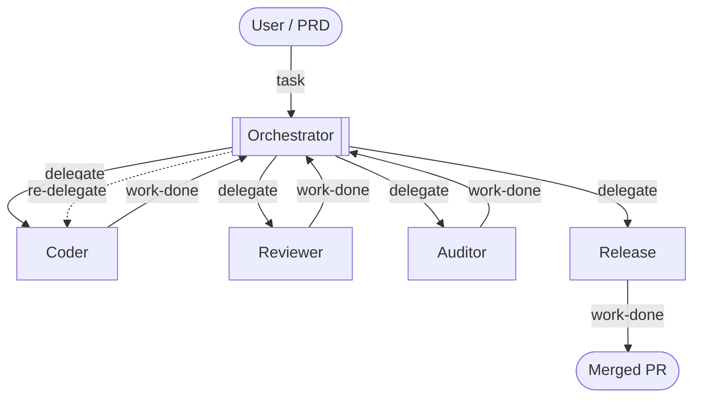

# Orchestration

Orchestrations are multi-agent pipelines where a designated **orchestrator** agent coordinates work across one or more **worker** agents. Each worker runs in its own pane, gets tasks injected into it, and signals completion back to the orchestrator — all automatically, through the daemon.

> **Prefer video?** This page is a written companion to the walkthrough below — a full development pipeline (coder → reviewer + auditor → release) running end-to-end on a real project.

<a href="https://youtu.be/ZIWWDDu02Ik"></a>

## Why orchestrations work

An agent reviewing its own code is like a developer reviewing their own PR: the same assumptions, the same blind spots, the same conviction that what they wrote is correct. Running the reviewer as a separate agent — in a fresh session, pointed at a different model if you like — removes that bias.

Specialization compounds the effect. An agent forced to juggle several concerns at once does each one less well than an agent with a single focused brief. Giving each role its own agent — and, where you can, its own model family — keeps every pass sharp: a fresh, specialized context with no unrelated baggage, and independent judgment that does not inherit another agent's blind spots.

Orchestrations also address context decay. As an agent accumulates a long conversation, implementation details, error traces, and tool output pile up and dilute focus. Worker agents receive only the context the orchestrator explicitly hands them, keeping each one sharp on its task.

The tradeoff is wall-clock time: chaining agents is slower than a single run. But since you are not sitting there watching, the duration rarely matters. You hand off a task, do something else, and come back when the pipeline is done.

## How it works

A pipeline has exactly one orchestrator and one or more workers. The orchestrator's job is coordination: delegating tasks, receiving summaries, and deciding what to do next. It does not write code, run tests, or modify files — those stay with workers.

The workers you define depend entirely on your project. A software development pipeline might have a coder, reviewer, auditor, and release agent. A research pipeline might have a planner, researcher, and writer. The diagram below shows one common shape:



Delegation signals travel through the daemon: no messages are lost if you detach the TUI and reattach later. Work-done feedback lands in the orchestrator's scrollback, survives any number of detach/reattach cycles, and is visible the moment you open the orchestration tab.

## Quick setup


The fastest way to get an orchestration config is to let an agent generate it from your project.

1. Launch `dot-agent-deck` and open a pane on your project directory.
2. Press `Ctrl+d` to enter command mode, then press `g` on the agent's dashboard card.
3. Choose **Yes** in the prompt. The deck sends a structured prompt asking the agent to analyze your project, pick roles from the [built-in role library](#role-library), wire up the commands it finds (devbox scripts, Makefile targets, bare `claude`/`opencode`/`pi`/`codex`/`devin`, etc.), and propose the config.
4. Review the proposal. The agent will list each role and explain why it chose it.
5. Tell the agent what to drop or change — or confirm as-is — and it writes `.dot-agent-deck.toml` to your project root.

<div style={{clear: 'both'}}></div>

The generated file includes both `[[modes]]` and `[[orchestrations]]`. You can remove either section if you only need one.

To write the config by hand, use the [configuration reference](#configuration-reference) later on this page as a guide. `dot-agent-deck init` generates a modes-only starter template — it does not include an orchestration block.

## Starting an orchestration tab

Opening an orchestration tab uses the same `Ctrl+n` flow as a regular pane, but the **Mode** field selects an orchestration instead of a workspace mode.

1. Press `Ctrl+n` to open the new-pane form.
2. Use `Enter` to step into directories and `Space` to select the project directory that contains your `.dot-agent-deck.toml` with an `[[orchestrations]]` block.
3. In the unified form, use `Left`/`Right` (or `h`/`l`) to cycle the **Mode** field past any workspace modes until the orchestration name appears.
4. Press `Enter`. The command field is not used for orchestration tabs — each role pane is launched with its own [`command`](#configuration-reference) from the config.

A new tab opens with one pane per role. The role cards appear on the left sidebar; the orchestrator's pane is active on the right. Each pane has the role's `command` running inside it.


An orchestration can also be started **in an isolated copy of the repository** rather than in your working tree, by asking a dispatcher pane for it — useful for running several orchestrations in parallel without them treading on each other. See [Dispatcher Mode](dispatcher-mode.md).

### Navigating the orchestration tab

These require command mode — press `Ctrl+d` first if you are typing in a role pane:

| Key | Action |
|---|---|
| `Left` / `Right` (or `h` / `l`) | Cycle to previous / next tab |
| `1`–`9` | Jump to role card N and focus its pane |
| `Ctrl+w` | Close the orchestration tab (stops all role panes), after a confirmation |
| `Ctrl+e` | Toggle the command-entry lock — whether you can type directly into a worker pane (see below) |

These work from anywhere, including while typing in a role pane:

| Key | Action |
|---|---|
| `Ctrl+PageDown` / `Ctrl+PageUp` | Cycle to next / previous tab |

The sidebar shows each role's status live (thinking, working, waiting, idle, error) so you can see at a glance who is busy without switching panes.

The tab bar carries the same signal one level up: a tab's label is colored by the single most urgent status among its panes, in priority order Error (red) > Needs Input (yellow) > Working (green) > Thinking (blue), so you can tell which of several open tabs needs attention without switching to any of them — including the tab you are currently on. This applies to both orchestration tabs (colored by their roles' aggregate status) and worker (Mode) tabs (colored by their own agent pane's status) — the Dashboard tab is the one deliberate exception, since it would otherwise stay near-permanently tinted by aggregating every session on the deck. Color always reports status: a tab whose pane(s) are all idle is colored with the idle color too, so a tab's color always equals its worker's status color with no exceptions. The active tab is marked with bold rather than a reversed block, which is what lets it carry a status color at all.

In the default `Stacked` pane layout, only the focused role's pane is drawn — switching roles swaps which pane is visible, but every other role's agent keeps running underneath, and the sidebar is what tells you it's still busy or idle. Toggle to `Tiled` (`Ctrl+t`) to see every role's pane at once.

### Typing into a worker is locked by default

You talk to the orchestrator; the orchestrator talks to the workers. On an orchestration tab the deck makes that the default rather than a convention you have to remember: keystrokes aimed at a worker role are dropped instead of delivered — and so are pastes — and the bottom bar says `Pane locked — Ctrl+d, Ctrl+e, Ctrl+d to type here`. A persistent ` LOCKED ` / ` UNLOCKED ` chip in the bottom bar shows the current state while you are typing into a pane. The orchestrator's own pane is never locked, and Dashboard and mode tabs are not affected at all.

The reason is that an orchestration is one workflow with a single coordinator. Type into a worker and you become a second, uncoordinated actor inside it: you change state the orchestrator believes it owns, and there is no path for it to learn that you did. What you usually get is not an obviously broken deck but a quietly diverged one — commonly the orchestrator and a worker contradicting each other into a deadlock. And most of the time it is not even deliberate: you open a worker pane to see how it is doing, get distracted, and type your next instruction into the pane that happens to be in front of you rather than the one you meant.

**Nothing is read-only, and nothing is taken away.** When you do want to reach into a worker — a provider hiccup parked an agent, a weaker model never called `work-done`, an agent is waiting somewhere you did not expect — it costs one deliberate `Ctrl+d`, `Ctrl+e`. That pause is the whole feature: it converts a reflex into a decision. Unlocking reports `Pane entry: unlocked` and leaves you in command mode, so press `Ctrl+d` once more to return to the pane and type; the same chord locks it again. The setting is one value for the whole deck, so unlocking on one orchestration tab unlocks all of them and a newly opened tab adopts the current value; it is not saved across restarts, so every deck starts locked.

**A worker that has stopped and asked you something is never locked.** While a role pane reports `WaitingForInput` — an agent showing a permission prompt, a numbered option list, or a plain "what next?" — every key reaches it with no unlock at all, and the lock re-engages the instant that status clears. Answering a question the agent itself asked is a response to a request, not an intrusion into one. Two limits are worth knowing: an agent that never reports `WaitingForInput` gets no exemption and still needs the deliberate unlock, and a pane that is temporarily typeable for this reason looks no different from a locked one, so a stuck or mis-reported status leaves a pane open with no visual cue.

`Ctrl+e` is claimed only in command mode, like `Ctrl+w`. While you are typing in a role pane the deck does not take it, so `0x05` reaches the agent and readline's `end-of-line` works normally.

#### Focus follows the lock

While the deck is **locked**, it steers focus for you within the active orchestration tab: onto a role pane the moment it starts waiting on you — the lowest-numbered one first if several are waiting at once, advancing as each is dealt with — and back to the orchestrator once nothing is waiting any more. Focus never leaves the active tab to chase a waiting pane elsewhere; the tab label's colour already flags that.

While the deck is **unlocked**, no automatic focus move happens at all. Focus stays exactly where you put it — through a worker starting to wait, and through it finishing — until you lock again.

## How delegation works

The orchestrator delegates a task to one or more workers. The deck delivers the task to each worker's pane automatically, including the worker's [`prompt_template`](#configuration-reference) as standing context. Each worker works independently, then signals completion. The deck notifies the orchestrator, which reads the summary and decides what to do next.


A worker that never signals completion would otherwise stall the pipeline silently, since the orchestrator is parked waiting for it and gets no turn in which to notice. The daemon covers that case on a timeout — see [Idle Workers & Notifications](idle-workers-and-notifications.md), which also shows how to turn the moments a run stops and waits for you into messages that reach you away from the terminal.

### What `clear` does to delivery

[`clear`](#configuration-reference) decides whether the worker that receives a task is the same process that handled the last one, and that has consequences for how the task is delivered.

With `clear = false` the agent is left running. The task is typed straight into the session that is already sitting there, so delivery is immediate and the worker keeps everything it learned from previous delegations.

With `clear = true` — the default — every delegation is a cold start. The deck terminates the worker's agent (SIGTERM, escalating to SIGKILL if it does not go), launches the role's `command` again in the same pane, and delivers the task to the replacement. The role card stays where it is and keeps its name; the process underneath is new and the previous conversation is gone. That is the point: workers get a clean context per task instead of accumulating one long, drifting session.

There does not have to be a worker there to begin with. If the role's pane is empty — you closed it, or its agent died — the delegation creates a fresh one from the role's `command` instead of failing, so a role stays reachable for as long as the orchestration is running. If the replacement cannot be started at all, the deck says so in your orchestrator's pane rather than dropping the task silently; see [A delegated worker never came up](#a-delegated-worker-never-came-up).

The delivery cost of that restart is timing. A freshly launched agent announces that its session has started well **before** its input box is ready to accept a line of text and treat Enter as "submit", so a task written the instant that signal arrives can land in a pane that is not listening yet. Where the write falls on the agent's startup decides what you see: the task text sitting in the worker's input box unsubmitted until a human presses Enter, or nothing at all — no text, no activity, a worker that looks healthy and idle while the orchestrator waits for a `work-done` that will never come.

The deck therefore holds a `clear = true` task for a short **readiness buffer** after the replacement signals its session start (and after the fallback wait expires, for agents that never signal at all). The default is 1000 ms: the spawn-time path's 500 ms, which was tuned for a warm pane, doubled because a respawn is a cold start. Nothing about this is configured per role; the only effect you should notice is that a `clear = true` delegation takes about a second longer to appear in the worker's pane than a `clear = false` one.

Be clear about what that buys you: a fixed delay makes the race much less likely, but it cannot *prove* that the replacement is listening. The regression test behind this change measures a deterministic test fixture — deliberately built to ignore input for 650 ms — and confirms the task is lost with the buffer at `0` and delivered and submitted at `1000`, which pins the mechanism. It does not measure how long any real agent version takes to boot on your machine. A real "ready for input" signal from the agent side is the actual fix, and it is tracked in [#243](https://github.com/vfarcic/dot-agent-deck/issues/243).

So if tasks still go missing on your machine — a heavily loaded host, or an agent that boots more slowly than the buffer allows for — raise the buffer with the `DOT_AGENT_DECK_DELEGATE_READINESS_BUFFER_MS` environment variable, in milliseconds, on the process that starts the deck:

```bash
DOT_AGENT_DECK_DELEGATE_READINESS_BUFFER_MS=2000 dot-agent-deck
```

Values above `30000` are capped, and `0` disables the wait entirely (the pre-fix behaviour — useful only for reproducing the problem). Please also report it: a machine that needs more than a second is exactly the evidence #243 needs.

#### If you are on an older release: `clear = false` is the workaround

Before this buffer existed, `clear = true` delegations could be lost outright, and users hit it consistently enough that two of them ([#199](https://github.com/vfarcic/dot-agent-deck/issues/199)) independently found the same workaround: set `clear = false` on the affected roles. It works because it removes the respawn, and with it the race — the agent is already running and already listening, so there is no startup window to write into. It was confirmed across different agents and different agent versions.

The trade-off is exactly the one the flag exists to express: those workers now carry context between delegations. That is fine for a stateful role like `release` and usually unwanted for a `coder` who should not remember the last three tasks. On a release that includes the readiness buffer you should not need the workaround at all — set `clear` on each role for the context behaviour you want, not to dodge a delivery bug.

### Parallel delegation

The orchestrator can delegate to multiple workers simultaneously — for example, sending a code change to both a reviewer and an auditor at the same time. Both workers start immediately and report back independently when done.


## Context handoff

Workers cold-start with no memory of prior conversation, no access to other workers' outputs, and no shared scratchpad. Whatever the orchestrator includes in a delegation is the **entire context the worker has** — plus the worker's `prompt_template`. The orchestrator's `prompt_template` is where you tell it how to delegate well: which files to reference, how to summarise prior findings when chaining workers, and what to include when retrying after a failure.

Task text passed inline goes through the orchestrator's own shell before dot-agent-deck ever sees it, so parts of it can be executed or quietly dropped while the delegation still reports success. The generated protocol therefore defaults to handing the task over as a file, which is read off disk verbatim — nothing for you to configure.

That default assumes the agent is *authorized* to write a file, which is not the same as having a file-writing tool: a role launched with a restricted tool allowlist — `claude --allowedTools Bash Read`, say — hits an interactive approval prompt instead, and an unattended pane parks there forever. The protocol has a fallback for that case, but it cannot grant itself the tool. That part is yours: if a role is expected to take the primary path, add the file-writing tool to its `command`'s allowlist (e.g. `--allowedTools Bash Read Write`) so it never meets the prompt.

### Use a tracking file

The most effective pattern is to give the orchestrator a spec or task file — a PRD, a checklist, whatever suits your workflow — and tell it to read the file and keep it updated as work progresses. You can do this in the orchestrator's `prompt_template`, in your opening message to it, or both.

This pays off in two ways. First, the file becomes the single source of truth that workers can be pointed at directly, keeping delegations concise. Second, if the orchestrator's context gets compacted or the session is restarted, it can read the file and resume exactly where it left off without losing track of what has been done, what is in progress, and what comes next.

## Role library

Roles are fully defined by you — name, command, description, and prompt. There are no restrictions on what roles an orchestration can have.

When generating a config, the deck's agent picks from these built-in suggestions as a starting point. Treat the generated config as exactly that: a starting point. As you use the orchestration, you will find that certain prompt templates are too vague, certain roles are missing, or certain workflows need adjusting. Edit `.dot-agent-deck.toml` freely — changes take effect on the next delegation without restarting any panes.

| Role | Description | `clear` default |
|---|---|---|
| `coder` | Implements features, fixes bugs, refactors code | `true` |
| `reviewer` | Reviews code changes for correctness, style, and edge cases | `true` |
| `auditor` | Audits code for security vulnerabilities and unsafe patterns | `true` |
| `tester` | Writes and runs tests; useful for TDD-style flows | `true` |
| `documenter` | Writes and updates documentation only — never modifies source code | `true` |
| `release` | Runs the project's release/PR/merge workflow; never modifies code | `false` |
| `researcher` | Investigates the codebase or external sources to gather context | `true` |

### Why `release` has `clear = false`

The release flow is stateful: open branch → push → create PR → wait for CI → merge. If the agent is restarted between the PR creation and the CI wait, it loses the PR URL and branch name. `clear = false` lets the release agent carry state across delegations and retries, so it can pick up where it left off after a CI failure.

## Configuration reference

### `[[orchestrations]]`

| Field | Type | Required | Default | Description |
|---|---|---|---|---|
| `name` | string | no | cwd basename | Display name shown in the tab bar. Defaults to the project directory name when empty. |
| `roles` | array | yes | — | Role definitions. Must contain at least one role with `start = true`. |

### `[[orchestrations.roles]]`

| Field | Type | Required | Default | Description |
|---|---|---|---|---|
| `name` | string | yes | — | Role identifier. Shown on the role card in the deck so you can tell agents apart at a glance. Also used in `--to` arguments and in task/work-done file names. Must be unique within the orchestration. Must not contain `/`, `\`, or `..`. |
| `command` | string | yes | — | Shell command that launches the agent for this role. Must result in a `claude`, `opencode`, `pi`, `codex`, or `devin` process (e.g. `claude`, `devbox run agent-big`, `opencode --model gpt-4o`, `pi --provider openrouter`, `codex`, `devin`). Other commands will run but won't get live status tracking on the role card. |
| `start` | bool | no | `false` | `true` marks this role as the orchestrator. Exactly one role per orchestration must have `start = true`. |
| `description` | string | no | — | Tells the orchestrator when to use this role and what it is for, so it can decide which worker to delegate to in a given situation. Also shown on the role card in the deck. |
| `prompt_template` | string | no | — | Standing instructions the orchestrator prepends to every task it sends this role. When set, the orchestrator's task text — however it was passed, `--task` or `--task-file` — is appended under a `## Task` heading, so the worker sees both the template and the task together. |
| `clear` | bool | no | `true` | Restart the agent before each delegation, so every task starts from a clean context. The deck terminates the running agent, launches the role's `command` again in the same pane, waits through a readiness buffer, and only then delivers the task. Set to `false` for roles that need to carry state across delegations (e.g. a `release` role that must remember the PR URL and branch name when retrying after a CI failure). See [What `clear` does to delivery](#what-clear-does-to-delivery). |

### Minimal example

The deck writes the delegation protocol — how to pass a task safely — into the orchestrator's context automatically at launch, so no `prompt_template` below needs to restate it.

```toml
[[orchestrations]]
name = "code-review"

[[orchestrations.roles]]
name = "orchestrator"
command = "claude"
start = true
prompt_template = """
You coordinate the team. You NEVER write or review code yourself — only delegate.

Workflow:
- Delegate implementation to coder.
- After coder reports done, delegate to reviewer and auditor in parallel.
- If either flags blocking issues, re-delegate to coder with the specific feedback.
- Once the work is clean, delegate to release.

Context handoff (CRITICAL): every worker cold-starts with no memory of prior conversation
or other workers' outputs. The task text you send is the entire context the worker has.
Always include file paths, the relevant spec path, and any prior worker's findings when chaining.
"""

[[orchestrations.roles]]
name = "coder"
command = "claude --model sonnet"
description = "Implements features, fixes bugs, refactors code"
prompt_template = "Implement the requested change. Run the project's test command before reporting completion."

[[orchestrations.roles]]
name = "reviewer"
command = "claude"
description = "Reviews code changes for correctness, style, and edge cases"
prompt_template = "Review the change. Report findings only — do not modify code."

[[orchestrations.roles]]
name = "auditor"
command = "claude"
description = "Audits code for security vulnerabilities and unsafe patterns"
prompt_template = "Audit the change for security vulnerabilities. Report findings only — do not modify code."

[[orchestrations.roles]]
name = "release"
command = "claude --model haiku"
clear = false
description = "Runs the project's release flow; never modifies source code"
prompt_template = "Run the release flow (open PR, wait for CI, merge). Do NOT modify source code. If any step fails, report the exact error and stop."
```

## Example orchestrations

### Code review

Five-role pipeline: orchestrator → coder → reviewer + auditor (in parallel) → release.

```toml
[[orchestrations]]
name = "dev-flow"

[[orchestrations.roles]]
name = "orchestrator"
command = "claude --model opus"
start = true
prompt_template = """
You coordinate the team. You NEVER implement, review, or audit work yourself.

Workflow:
1. Delegate implementation to coder. Include the relevant spec path under prds/.
2. After coder is done, delegate to reviewer and auditor in parallel. Include the files coder changed.
3. If either reviewer or auditor flags a blocking issue, re-delegate to coder with the exact finding.
4. Repeat until reviewer and auditor are satisfied.
5. Before delegating to release, summarize what to validate end-to-end and STOP until the user confirms.
6. Delegate the release flow to release.

Context handoff (CRITICAL): workers cold-start with no memory of prior conversation or other
workers' outputs. Include all context in the task: file paths, spec paths, error messages, findings.
If context is long, write it to .dot-agent-deck/<slug>.md and pass that file rather than pasting it.
"""

[[orchestrations.roles]]
name = "coder"
command = "claude --model sonnet"
description = "Implements features, fixes bugs, refactors code"
prompt_template = """
Implement the requested change. Read the spec file first if one is referenced.
Run the project's test suite before reporting completion.
Commit your changes before calling dot-agent-deck work-done.
If critical context is missing from the task, surface it in your work-done summary — the orchestrator will re-delegate with the missing context.
"""

[[orchestrations.roles]]
name = "reviewer"
command = "claude"
description = "Reviews code changes for correctness, style, and edge cases"
prompt_template = """
Review the change. Report findings only — do not modify code.
Focus on correctness, consistency with the codebase, edge cases, and missed requirements.
If a spec is referenced, verify the implementation matches it.
If critical context is missing, surface it in your work-done summary.
"""

[[orchestrations.roles]]
name = "auditor"
command = "opencode --model gpt-4o"
description = "Audits code for security vulnerabilities and unsafe patterns"
prompt_template = """
Audit the change for security vulnerabilities and OWASP top-10 class issues. Report findings only — do not modify code.
If the task references a file or diff, read it before starting.
If critical context is missing, surface it in your work-done summary.
"""

[[orchestrations.roles]]
name = "release"
command = "claude --model haiku"
clear = false
description = "Runs the project's release flow; never modifies source code"
prompt_template = """
Run the release flow: create branch, push, open PR, wait for CI, merge.
Do NOT modify source code. If any step fails, report the exact error and stop.
The orchestrator will re-delegate source fixes to coder.
"""
```

### TDD cycle

Three-role pipeline: orchestrator → tester (writes failing tests) → coder (makes them pass) → tester (validates) → repeat.

```toml
[[orchestrations]]
name = "tdd"

[[orchestrations.roles]]
name = "orchestrator"
command = "claude --model opus"
start = true
prompt_template = """
You run a TDD cycle. You NEVER write code or tests yourself.

Workflow:
1. Delegate to tester to write failing tests for the feature described in the incoming task.
2. Delegate to coder to implement until all tests pass.
3. Delegate back to tester to verify tests are green and coverage is adequate.
4. If tester finds gaps, re-delegate to coder with the specific failing tests.
5. Repeat until tester is satisfied.

Context handoff: workers cold-start with no memory. Include test file paths and feature spec
in every delegation. When chaining tester → coder, list which tests are failing.
"""

[[orchestrations.roles]]
name = "tester"
command = "claude"
description = "Writes and runs tests; useful for TDD-style flows"
prompt_template = """
Write tests first, then run them to confirm they fail before any implementation.
Follow the project's test layout and naming conventions.
Report which tests you wrote and which are currently failing/passing.
If critical context is missing, surface it in your work-done summary.
"""

[[orchestrations.roles]]
name = "coder"
command = "claude --model sonnet"
description = "Implements features, fixes bugs, refactors code"
prompt_template = """
Implement the minimum code to make the listed failing tests pass.
Do not modify the test files. Run the test suite before reporting completion.
If critical context is missing, surface it in your work-done summary.
"""
```

### Tagging delegations with `--subject`

`dot-agent-deck delegate` and `dot-agent-deck work-done` both accept an optional `--subject <tag>` flag — a short token identifying what the delegation is for, typically an issue or PR number. When the orchestrator supplies it on `delegate`, the daemon writes that exact flag into the worker's generated task file as the one to echo back on its own `work-done` call, and compares the two automatically: a mismatch is surfaced to the orchestrator as a visible warning, without blocking delivery either way.

This is the cheapest defense against a `work-done` report that answers the wrong task — a report that is coherent and well-formed but belongs to something else entirely, whether from a stale agent session, a misread task pointer, or cross-talk between concurrent orchestrations. The check only fires when the flag is actually supplied on `delegate`, so an untagged delegation gets no comparison at all — the practice only pays off once the orchestrator's `prompt_template` makes tagging the default rather than the exception:

```toml
prompt_template = """
...
Tag every delegation with --subject "<tag>" (an issue/PR number, or a short token
when there is no natural one) and check that the worker's work-done echoes the
same tag back — the daemon flags a mismatch visibly.
"""
```

`--subject` is symmetric across both ends of a delegation:

```bash
dot-agent-deck delegate --to coder --task-file '.dot-agent-deck/coder-task.md' --subject "#42"
dot-agent-deck work-done --task-file '.dot-agent-deck/report.md' --subject "#42"
```

### Monitored external waits (`wait start` / `wait done`)

A role's pane shows `Working` for as long as its agent has a live foreground process (see [rule 28 in `CLAUDE.md`](https://github.com/prageethw/dot-agent-deck/blob/main/CLAUDE.md) for the convention of keeping a sustained foreground command running for anything you're actively waiting on). That signal only exists while the agent's own turn is still open, though — it says nothing about the case where a role has already called `work-done` and its turn has ended, but it is still the party responsible for noticing an external outcome (a CI run settling, another agent finishing, an approval landing). Without something else to mark that span, the pane reads `Idle` for the whole time real work is still outstanding.

`wait start <label>` and `wait done <label> --outcome <success|failure|cancelled|timeout>` cover exactly that gap — a mechanical, explicit backstop for the case rule 28's live-process convention cannot reach, not a replacement for it. Run `wait start` once you become responsible for noticing an external dependency resolve, even after your own delegated task is done; run `wait done` with the terminal outcome once it does. While a wait is outstanding the pane composes to `Working` (unless a real agent event or a live shell descendant already says otherwise — see the composition rules below), even across polling gaps and even after the agent's own Stop hook has fired:

```bash
dot-agent-deck wait start ci-check
# ... time passes, possibly across multiple tool calls, possibly after work-done ...
dot-agent-deck wait done ci-check --outcome success
```

A pane carries at most one monitored wait at a time; `wait done`'s `<label>` is compared against the pane's active wait for attribution/logging only — a mismatch still clears the wait rather than being refused. `wait start` re-run before a matching `wait done` just resets the TTL clock and re-records the label.

**Composition, not clobber.** A monitored wait is one signal among several (a real agent event, a live shell descendant) that can each independently justify `Working`; the pane reverts to `Idle` only once every live signal has cleared. Concretely: if `wait start` is called while the pane is already `Working` for some other reason, `wait done` alone won't revert it while that other reason is still live, and conversely a `wait done` will still correctly revert the pane once it becomes the last live signal standing, even if it never itself promoted the status.

**Self-healing TTL.** A wait that is never explicitly cleared self-heals rather than wedging the pane `Working` forever: it expires after `DOT_AGENT_DECK_WAIT_TTL_SECS` seconds (default 30 minutes), clamped server-side to a hard ceiling of 6 hours regardless of what the environment variable requests, at which point the daemon clears it exactly as an explicit `wait done` would.

**Relationship to CLAUDE.md rule 28.** Rule 28 is a *convention* — how to structure a wait so the deck's existing shell-activity signal shows it. `wait start`/`wait done` is the *mechanical backstop* for the one shape that convention cannot express: a wait that outlives the role's own turn, with no foreground process left to be the evidence. Prefer rule 28's live-process pattern when your wait is a single foreground command within one turn; reach for `wait start`/`wait done` when the waiting genuinely spans turns.

## Validate your config

Run `dot-agent-deck validate` to check your `.dot-agent-deck.toml` for issues before opening an orchestration tab:

```bash
cd your-project
dot-agent-deck validate
```

## Running more than one orchestration

Concurrent orchestrations are safe **across directories**. Each orchestration tab is its own routing group, so a delegate never reaches another orchestration's worker and a work-done never reaches another orchestration's orchestrator — even when two orchestrations share the same `name`. Distinct directories also mean distinct `.dot-agent-deck/` coordination files and distinct working trees, so the two pipelines never contend for the same state on disk either.

For parallel lines of work on the *same project*, give each orchestration its own **git worktree**. A worktree is a second checkout of the same repository at a different path, so each orchestration gets its own directory — its own routing group, its own coordination files, its own source tree — while sharing one git history and one set of branches. This is the model the deck's own [scheduled issue dispatch](scheduled-tasks.md) already uses: one worktree per dispatched issue.

Create one however you prefer. By hand it is a single command:

```bash
git worktree add ../myproject-feature-x -b feature-x
```

If your project vendors the `/worktree-prd` skill (from [dot-ai](https://github.com/vfarcic/dot-ai)), ask an agent in the deck to run it and it creates the worktree and branch for you. Then open a new orchestration tab with `Ctrl+n` and point the directory field at the worktree.

### Listing worktrees by owner

`dot-agent-deck worktree list` shows every linked worktree with its resolved PR state, cleanliness, and gate verdict, including an OWNER column naming who owns it: the marker's recorded identity for a deck-created worktree, or `human:<login>@<host>` for one you created by hand (e.g. a plain `git worktree add`). A dash appears only when ownership could not be resolved at all — a legacy marker that predates this feature and names nobody, `gh` unavailable, or the worktree's own git metadata directory could not be verified; `worktree list --json`'s `owner_kind` and `owner_reason` fields tell those cases apart.

It also discovers deck-owned **isolated clones** — fully independent repositories the deck provisions as siblings of the root checkout when a 2nd or later concurrent orchestration (see "Running more than one orchestration" above) shares that checkout with a live one, so their git operations can't race each other. These rows carry `kind: "isolated_clone"` (a linked worktree's row is `kind: "linked"`) and normally a VERDICT of `isolated_clone` rather than `remove`/`ask`/`keep`, since deleting one destroys its own `.git` — a clean working tree alone does not prove its local-only branch commits are safe to lose. As of fork#325 M4c, widened to six conditions by fork issue #546 hazard 2, a row instead gets the VERDICT `isolated_clone_reclaimable` when the AND of six conditions all hold: the deck's own attach-lock provenance artifact exists for it (a forged sibling directory can't fake this), its working tree is clean, it has exactly one local branch (the one it's currently on), its `git stash list` is empty, its own current HEAD commit SHA equals a MERGED PR's own `headRefOid` exactly — the PR branch's own tip commit, not the merge commit GitHub creates on the base branch — and it has not been explicitly pinned (`worker-agent-deck`'s pin/unpin mechanism rewrites the same provenance artifact's `pinned=` field; only a literal `pinned=true` counts, and an artifact that exists but can't be *read* fails closed exactly like every other unresolvable signal here, never treated as unpinned). Reaching that verdict is not the same as being removed: exactly like an `ask`-verdict linked worktree, a bare `worktree reclaim` only reports it as pending, and actual deletion still requires `--yes` — which, for an eligible isolated clone, deletes that clone's entire `.git`, not just a linked worktree, so the stakes of that `--yes` are categorically higher than for an ordinary worktree even though the command is the same. Immediately before that deletion the deck re-derives 5 of the 6 conditions fresh from disk and refuses rather than deletes on any mismatch, closing the window between examining a clone and actually removing it (including a pin applied in that window) — but not liveness: none of the six conditions prove the clone isn't currently in active use, since `worktree reclaim` is a plain CLI subprocess with no connection to the daemon's own in-process liveness tracking, and this is accepted as a documented residual rather than papered over with a guess. A row that doesn't satisfy all six stays permanently at the conservative `isolated_clone` verdict and is never auto-removed by `worktree reclaim` regardless of PR state or cleanliness; remove one by hand (`rm -rf`) once the work it holds is captured elsewhere. **Known limitation (tracked for a future M4b fix):** discovery anchors on the invoking repo's own common `.git` dir, so `worktree list`/`--mine` run from *inside* an isolated clone excludes that clone itself and cannot see its siblings either (their lock files live under the root checkout's common dir, not the clone's) — meaning the Nth concurrent orchestration, which by definition runs inside an isolated clone, currently gets an empty answer from exactly the command this milestone exists to serve for it.

Run with `--mine` from inside an orchestration pane, it lists only the worktrees *that orchestration* created — useful for an autonomous agent that needs to enumerate its own work without seeing every other orchestration's worktrees too:

```bash
dot-agent-deck worktree list --mine
```

This works immediately after a daemon restart: ownership is matched by comparing the worktree's on-disk marker against the pane's own `DOT_AGENT_DECK_WORKTREE_OWNER` environment variable (set automatically in every pane of an orchestration that **created a worktree** — not every orchestration pane; one started directly in an existing checkout, with no worktree slug typed, carries no variable at all. `DOT_AGENT_DECK_PANE_ID` really is set in every orchestration pane, so do not read the two as equivalent), never by asking the daemon. This identity is also saved in your session, so closing and reopening a tab restores it with the SAME identity — `--mine` still matches the worktrees it created earlier, with two exceptions: a tab whose saved session predates this — one saved before the identity was captured at all, or before this specific field was added — restores with no identity; and a tab that was reattached to a still-running ("warm") daemon has its metadata rebuilt without the saved identity, so a session saved in that state also restores with none. Either way, `--mine` from that tab fails loudly, the same as from outside any orchestration pane — rather than guessing, which could hand it another orchestration's worktrees. Run outside an orchestration pane, or in a pane whose orchestration created no worktree, `--mine` fails loudly rather than falling back to "everything" or silently printing "none" — a wrong answer here would hand one orchestration another's worktrees.

### Same-directory orchestrations are discouraged

Opening a second orchestration in a directory that already runs one is usually still allowed, and routing stays correct — but one resource cannot be partitioned, no matter what the deck does:

- **The working tree.** Both sets of workers edit the same files, stage into the same git index, and build into the same target directory. This is the same hazard as two people working in one checkout, and no amount of file namespacing fixes it. (As of issue #613, `.dot-agent-deck/worker-task-<role>-<pane digest>.md` is keyed on the target pane as well as role name — mirroring `work-done-<role>-<pane digest>.md` below — so two orchestrations that both have a `coder` role no longer clobber each other's task file; each pane gets its own. The pointer the worker receives is also now an absolute path, so it resolves correctly even if the worker's own process cwd has drifted from the daemon's belief about it. The coordination files are therefore no longer a shared resource — only the working tree above is.)

So when you select an orchestration whose directory already hosts a live one, the new-pane form shows a warning:

```
  ! This directory already runs an orchestration.
    Both share one working tree; /worktree-prd
    isolates it.
```

The warning is non-blocking in every case except one: pressing `Enter` normally opens the tab as usual, and it exists to make the shared working tree explicit at the moment it starts to matter, so proceeding is a deliberate choice rather than a surprise. The one exception (issue #489) is a **blank** Worktree field submitted against a directory that **exactly matches** — same working directory, not a worktree carved off it — a live orchestration's own directory: that specific submission is refused outright, and the tab does not open. A **typed** Worktree slug is unaffected by this exception and still isolates into its own worktree (or, if a live orchestration already shares that root checkout's object store, an isolated clone) as before. If the two orchestrations genuinely need to run at once, type a Worktree slug rather than leaving it blank.

## Troubleshooting

### Worker says `DOT_AGENT_DECK_PANE_ID is not set`

The `dot-agent-deck delegate` and `work-done` commands read `DOT_AGENT_DECK_PANE_ID` to identify the calling pane. This variable is set automatically in every role pane when the orchestration tab opens. If it is missing, the command was run outside an orchestration pane (e.g. from your own terminal, not from inside an agent's pane).

### "delegate from non-orchestrator pane"

Only the role with `start = true` can call `dot-agent-deck delegate`. If a worker tries to delegate, the daemon rejects it and logs this message. Check that your config has exactly one role with `start = true`.

### Worker receives no task

The role name in `--to` must match the `name` field in the config exactly (case-sensitive). Check for typos. Also verify the worker's pane is part of the same orchestration tab — you cannot delegate across tabs.

### A delegated worker never came up

A `clear = true` delegation terminates the worker before it has a replacement, so if the replacement never starts, the pane is left with no agent and the task has nowhere to go. When that happens the deck writes `⚠ delegated worker never came up (dot-agent-deck daemon report)` into your orchestrator's pane and stops: nothing was delivered, and no `work-done` can arrive for that delegation. The notice names the worker's pane; the daemon log names the role and carries the underlying error.

The usual cause is the role's `command` — a launcher that fails in that directory, a binary that is not on the daemon's `PATH`, or an agent that exits immediately on start. Jump into the worker's pane and look at its scrollback: whatever the replacement printed before it died is still there. Running the role's `command` by hand in the worker's directory reproduces most of these in one step.

Before this notice existed the deck waited out its full 30-second readiness window, wrote into the empty pane, had the write refused, and dropped the task with only a line in the daemon log — so the orchestrator was told nothing was wrong and waited for a completion that could never arrive.

### Closing a worker's pane and then delegating to it

The role comes back. Closing a pane takes a few seconds to finish, and a `clear = true` delegation that arrives during it waits for the close to complete and then creates a fresh worker for the role — which is what `clear = true` means in the first place. The same recovery applies to a worker whose agent simply died: the next delegation to that role starts a new one rather than failing.

If you want a role to stay gone, remove it from `.dot-agent-deck.toml` (or close the whole orchestration tab); closing one worker's pane is not a way to take a role out of an orchestration that is still running.

### Orchestrator receives no work-done feedback

The daemon writes feedback to the orchestrator pane via the PTY. If the orchestrator's pane is closed, the feedback write fails silently. The `.dot-agent-deck/work-done-<role>-<pane digest>.md` file is written first (see "The output path" below), so for a delegated task it can still be read manually — unless the daemon could not write it, in which case the daemon log carries a `failed to write work-done summary` warning and any file at that path belongs to an **earlier** delegation (or is a partial write).

If you instead suspect the delegation itself stalled — rather than a feedback write failing — you don't have to wait out the idle-worker timeout to find out: `dot-agent-deck daemon status --json` reports, per pane, whether a delegation is still outstanding and for how long (`outstanding_delegation`, `silence_watch`, `delegation_commission`). See [Inspecting the local daemon](installation.md#json-for-scripts) for the field shapes.

### The output path is keyed on the reporting pane, not just the role

Two panes running the same role in the same working directory — two live orchestrations, or one worker re-delegated within the same run — are still two different panes, so the daemon's own output filename, `work-done-<role>-<pane digest>.md`, includes a digest of the reporting pane's id and is not shared between them. If a second `work-done` from the SAME pane arrives before the orchestrator has read the first (a re-delegation to that same worker), the prior report is archived aside — to `<file name>.prev.md`, or `.2.prev.md`, `.3.prev.md`, … on a further collision — rather than clobbered, and the orchestrator's feedback says so explicitly with a trailing sentence naming the archived file. The exact filename actually written is always named in the daemon log line for the write, and in the feedback's own pointer sentence, so nothing here has to be guessed at or reconstructed from the role name alone.

### Orchestrator is told a completion was "unsolicited"

The daemon records every delegation it dispatches, and a `work-done` that answers none of them is reported to the orchestrator with an explicit label saying so, followed by the worker's report inline. The commonest cause is a worker being tasked **directly by a person**: the `## When done` instruction survives in that worker's context from an earlier delegation, so it signals completion again for work the orchestrator never asked for. Without the label the orchestrator reads that as a delegated task coming back and re-plans on it.

Nothing is dropped — the report still arrives, framed as information rather than as delivered work — and the daemon's own `work-done-<role>-<pane digest>.md` path for that pane is deliberately left untouched, so an uncommissioned report cannot overwrite the last one the orchestrator did commission from that same pane. If you want a completion to be reported as delegated work, delegate it: task the worker through the orchestrator rather than typing into its pane.

Two consequences of "untouched" are worth knowing before you go looking for a file. An **orchestrator** running `dot-agent-deck work-done` on itself without `--done` counts as uncommissioned too — nobody delegates to the orchestrator — so no `work-done-<orchestrator-role>.md` is written for it; use `--done` to close out the orchestration, or delegate the work to a role. And a delegate that never actually **reached** its worker — the identity gate refused the write, a `clear = true` respawn failed and left the notice `⚠ respawn failed for role '<role>'` in your orchestrator pane, or the replacement never came up and left `⚠ delegated worker never came up` there — commissions nothing, so a completion arriving from that worker afterwards is uncommissioned by the same rule. That is deliberate: the alternative is a stale commission that quietly relabels some later, unrelated completion as delegated work.

Don't stop at the "unsolicited" label, either — the same `daemon status --json` fields that help with a stalled delegation (previous section) are also the right way to sanity-check an *arriving* notification before acting on it, unsolicited or not: compare it against what `outstanding_delegation`/`silence_watch`/`delegation_commission` actually shows for that pane rather than trusting the notification's own framing. A stale or misrouted signal can otherwise look identical to a genuine one, especially with several concurrent orchestrations in play.

### The summary file could not be written

When the daemon cannot write `.dot-agent-deck/work-done-<role>-<pane digest>.md` — no working directory recorded for the pane, the `.dot-agent-deck` directory cannot be created, the write itself fails, or a prior report already at that same pane's path could not be archived aside — it does **not** tell the orchestrator to read that path. It says the file is unavailable and inlines the worker's report into the feedback instead. That matters because a failed write, or a failed archive, leaves whatever was already there — an earlier delegation's report, or a partial write — sitting at the path, well-formed and indistinguishable from the current one if pointed at blindly. An inlined report loses its Markdown formatting (the feedback is collapsed to a single line) and is truncated past 4000 characters; the worker still holds the full text.

### Prompt template is not being applied

The daemon re-reads `.dot-agent-deck.toml` on every delegation, so edits take effect immediately without restarting the pane. Verify the role's `name` in the config matches the `--to` argument exactly, and that the config file is at the project root.

### Two orchestrations with the same project name conflict

If you run two orchestration tabs from different directories that happen to have the same basename (e.g. `~/a/myproject` and `~/b/myproject`), the daemon disambiguates delegation routing by their full path. Two tabs of the *same* orchestration in the *same* directory are also routed separately — each tab is its own routing group — but they still share the coordination files and the working tree, which is why the deck warns about that case. See [Running more than one orchestration](#running-more-than-one-orchestration).

## See also

- [Idle Workers & Notifications](idle-workers-and-notifications.md) — the timeout that reports a silent worker to the orchestrator, and an example recipe for notifying yourself
- [Workspace Modes](workspace-modes.md) — the simpler tab type that pairs an agent with live side panes
- [Configuration](configuration.md) — global and project-level configuration options
- [Keyboard Shortcuts](keyboard-shortcuts.md) — all keybindings, including tab navigation
